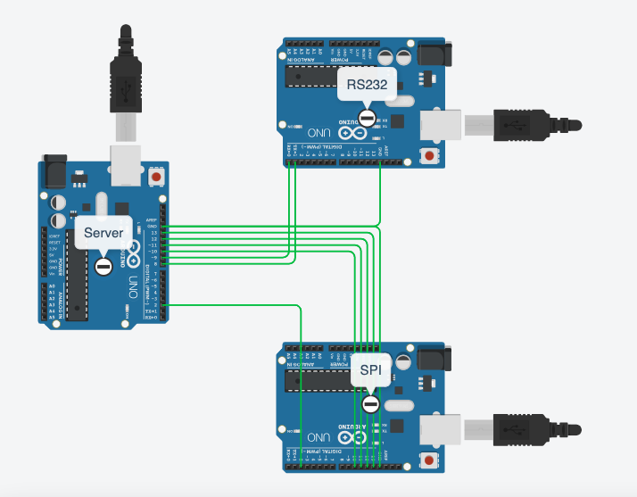
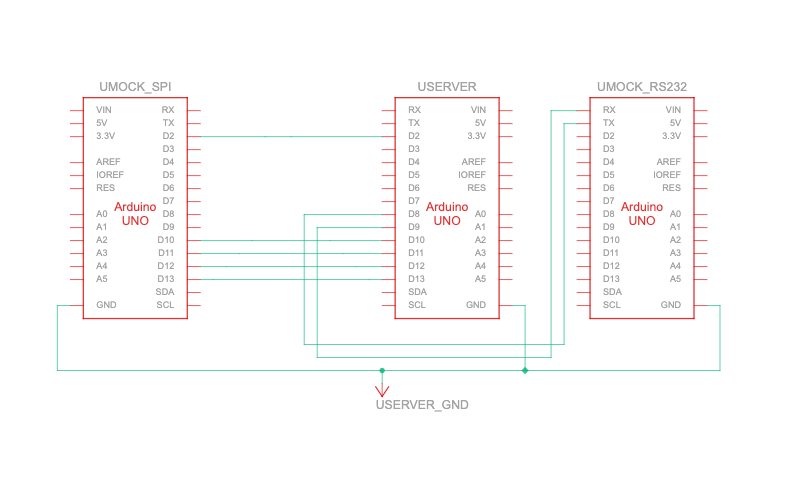

<h1 align="center">
  <br>
  
  Tractor Mount
  <br>
</h1>

<h4 align="center">Embedded Tractor Automation Server, able to control multiple Implements.</h4>


## How To Use

Clone the repository
```bash
# Clone this repository
$ git clone https://github.com/DuviH/tractor-mount

```
Go to the common.hpp located at the include folder.<br>
There you can Choose the types of implements to include in your server.<br>
There are also a few defines for each implement there, make sure they fit your needs, and the platform you're using<br>


Compile the project.<br>
I've Compiled it using the Platform.io extension on VSCode.<br>
The project was built for Arduino Uno, But with a few changes it should fit other platforms as well.<br>
If you do use a different platform, make sure that the pins you're using are compatible.
<br>
Flash the server arduino.<br>
Open A serial connection with it. the baud rate should match `SERIAL_BAUD` defined at common.hpp

## Server
The server class is in charge with taking commands from the upper level application, while keeping control over the different implements.<br>

The server also has a Timer based ISR, which is designed to periodically check the fuel level of each implement, and turning it off in case its at critical level.

#### Sending commands to the Server
The command format is as follows:<br>
\<Implement> \<set/get> \<attribute> \<needed params><br>

supported implements:
- SPI
- RS232

supported commands:
- set power on/off
- get power
- get fuel


## Implement Types

All implements inherit from the base class, TractorImplement.<br>
This allows for polymorphism when interacting with each implement.<br>
The base class is an abstract class with pure virtual methods, and no object from that class should be created.<br>

Useable implement classes are:

- RS232Implement - this implement communicates with the server useing 2Pins, 1 for Tx & 1 for RX, set the pin numbers at common.hpp
- SPIImplement - this implement communicates with the server useing 4Pins, a slave select, MISO, MOSI, and a slave ready pin, that signles the server to read from the slave.
  
## Connections

Default connections can be seen here:



## Current Issues

Currently no Implement mocks are implemented, which makes it hard to test the code in full operation.<br>

Idealy I would have wanted to implement an array of String, Implement pairs, which will make it easier to check all implement's fuel level when adding more implements.<br>

Currently only 1 spi implement is supported, due to the fact that there is no logic for selecting the correct slave select pin. <br>

Code readability and arrow head in a few code sections.

